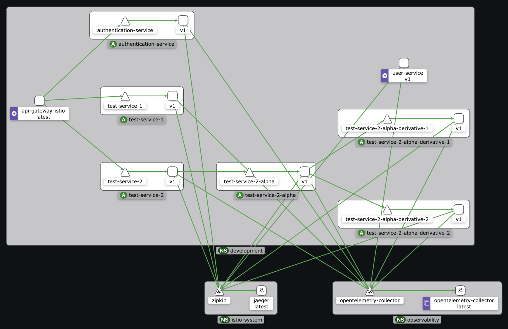

# `local-kubernetes-playground`

Software engineers at ETHR previously used a variation of the following project as a playground for software
development, automation testing,
research, and for demonstrating proof-of-concepts.

This playground was the motivation behind establishing `x-ethr` and its related open-source repositories.

> [!IMPORTANT]
> The following project requires an expansive amount of knowledge around cloud-providers (AWS), development, kubernetes,
> and overall
> systems. While the guide can be followed step-by-step to produce a fully functioning cluster, there
> are [requirements](#requirements)
> that would be challenging for beginners to 1. understand, 2. setup, 3. debug.
>
> If requirements are correctly met, the entirety of this project can be deployed in under five minutes by simply
> following the [usage](#usage) section.
>
> Users of `local-kubernetes-playground` will involve themselves in the following disciplines:
> - Software Engineering
> - DevOps
> - Cloud & Platform Engineering (AWS)
> - Systems Administration (Kubernetes)
> - GitOps
> - Databases
> - Security

## Example

***The Playground's Deployed Service Mesh***



## Requirements

> [!IMPORTANT]
> Usage, requirements, and documentation was vetted on a Mac Studio, M1 Max 2022 on MacOS, Sonoma 14.5. Other systems
> are likely subject to
> incompatibilities.

###### System

- MacOS with Administrative Privileges
- [`go`](https://go.dev/doc/install)
- [`cloud-provider-kind`](https://github.com/kubernetes-sigs/cloud-provider-kind)
- [Homebrew](https://brew.sh)
- [Kind](https://kind.sigs.k8s.io/docs/user/quick-start/)
- [`kubectl`](https://kubernetes.io/docs/tasks/tools/install-kubectl)
- [Docker Desktop](https://www.docker.com/products/docker-desktop/)
- [`istioctl`](https://istio.io/latest/docs/setup/getting-started/)
- [`ethr-cli`](https://github.com/x-ethr/ethr-cli)
- [`aws-cli`](https://docs.aws.amazon.com/cli/latest/userguide/getting-started-install.html)
- [`flux`](https://fluxcd.io/flux/get-started/)
- [`psql`](https://www.postgresql.org/download/)
- [Node.js + `npm`](https://nodejs.org/en/download/package-manager)

###### External-Provider(s)

Setup relating to AWS account(s) and related requirements are far outside scope of the project.

- [Flux local setup](https://fluxcd.io/flux/get-started/)

- GitHub PAT

- A valid AWS account
    - A configured `default` profile
    - Secrets in AWS SecretsManager for local development purposes. See the scripts' sections in [usage](#usage) for
      details.

###### Optional(s)

- [OpenLens](https://github.com/MuhammedKalkan/OpenLens) - Kubernetes UI Dashboard

## Usage

> [!NOTE]
> During the first minute or two, there may be a few warnings that surface. Due to Kubernetes reconciliation, all errors
> should resolve by minute three or four.

1. Setup a local load-balancer.
    ```bash
    go install sigs.k8s.io/cloud-provider-kind@latest
    sudo install "$(go env --json | jq -r ".GOPATH")/bin/cloud-provider-kind" /usr/local/bin
    sudo cloud-provider-kind
    ```
2. Create a cluster via `kind`.
    ```bash
    kind create cluster --config "configuration.yaml"
    kubectl config set-context "$(printf "%s-kind" "kind")"
    ```
3. Establish bootstrap secret(s).
    ```bash
    mkdir -p ./kustomize/secrets/.secrets
   
    printf "%s" "${GITHUB_USER}" > ./kustomize/secrets/.secrets/username
    printf "%s" "${GITHUB_TOKEN}" > ./kustomize/secrets/.secrets/password

    function access-key-id() {
        printf "%s" "$(aws secretsmanager get-secret-value --secret-id "local/external-secrets/provider/aws/credentials" --query SecretString | jq -r | jq -r ".\"aws-access-key-id\"")"
    }

    function secret-access-key() {
        printf "%s" "$(aws secretsmanager get-secret-value --secret-id "local/external-secrets/provider/aws/credentials" --query SecretString | jq -r | jq -r ".\"aws-secret-access-key\"")"
    }

    printf "%s" "$(access-key-id)" > ./kustomize/secrets/.secrets/aws-access-key-id
    printf "%s" "$(secret-access-key)" > ./kustomize/secrets/.secrets/aws-secret-access-key
    
    kubectl apply --kustomize ./kustomize/secrets --wait
    ```
    - Requires `aws-cli` is installed with a valid `default` profile.
    - Assumes a secret in SecretsManager called `local/external-secrets/provider/aws/credentials` exists, and contains
      the following contents:
        ```
        "{\"aws-access-key-id\":\"...\",\"aws-secret-access-key\":\"...\"}"
        ```
        - By no means should this secret contain credentials to Administrative function(s). Lock this API user's access
          down, as it's really only for local development purposes.
4. Bootstrap.
    ```bash
    flux bootstrap github --repository "https://github.com/x-ethr/cluster-management" \
        --owner "x-ethr" \
        --private "false" \
        --personal "false" \
        --path "clusters/local"
    ```
    - For users outside the `x-ethr` organization, fork, import, or copy
      the https://github.com/x-ethr/cluster-management repository; or use a customized Flux GitOps project.
5. Sync local cluster repository's `vendors`.
    ```bash
    git submodule update --remote --recursive
    ```
6. Add `kustomization.yaml` to new cluster directory (only applicable during first-time cluster setup).
    ```bash
    cat << EOF > ./vendors/cluster-management/clusters/local/kustomization.yaml
    apiVersion: kustomize.config.k8s.io/v1beta1
    kind: Kustomization
    resources: []
    EOF
    ```
7. Optionally, update the `Kustomization.flux-system.spec.interval` (changes each time a local cluster is bootstrapped).
8. Push local changes to `vendors` submodules.
    ```bash
    git submodule foreach "git add . && git commit --message \"Git Submodule Update(s)\" && git push -u origin HEAD:main" 
    ```
9. Start the local registry.
    ```bash
    bash ./scripts/registry.bash
    ```
10. Wait for the various resources to reconcile successfully.
11. Generate ECDSA key(s) and a jwt signing key all of `development`.
    ```bash
    ethr-cli ecdsa --mkdir --file "./applications/.secrets/ecdsa"
    ethr-cli random token --length 32 > "./applications/.secrets/jwt-signing-key"
    ```
12. Initialize the kubernetes gateway and primary `development` resource(s).
    ```bash
    kubectl apply --kustomize ./applications
    ```
13. Deploy redis.
    ```bash
    kubectl apply --kustomize ./kustomize/redis --wait
    kubectl port-forward --namespace caching services/redis 6379:6379
    ```
14. Setup and deploy the database(s).
    ```bash
    mkdir -p ./kustomize/database/.secrets

    printf "%s" "postgres" > ./kustomize/database/.secrets/POSTGRES_DB
    printf "%s" "api-service-user" > ./kustomize/database/.secrets/POSTGRES_USER
    printf "%s" "$(openssl rand -base64 16)" > ./kustomize/database/.secrets/POSTGRES_PASSWORD
    
    mkdir -p ./applications/user-service/kustomize/.secrets
    cp -f ./kustomize/database/.secrets/POSTGRES_USER ./applications/user-service/kustomize/.secrets/PGUSER
    cp -f ./kustomize/database/.secrets/POSTGRES_PASSWORD ./applications/user-service/kustomize/.secrets/PGPASSWORD
    printf "%s" "user-service" > ./applications/user-service/kustomize/.secrets/PGDATABASE
    
    mkdir -p ./applications/authentication-service/kustomize/.secrets
    cp -f ./kustomize/database/.secrets/POSTGRES_USER ./applications/authentication-service/kustomize/.secrets/PGUSER
    cp -f ./kustomize/database/.secrets/POSTGRES_PASSWORD ./applications/authentication-service/kustomize/.secrets/PGPASSWORD
    printf "%s" "authentication-service" > ./applications/authentication-service/kustomize/.secrets/PGDATABASE
    
    function uri() {
        printf "%s:%s:%s:%s:%s" "localhost" "5432" "postgres" "$(head ./kustomize/database/.secrets/POSTGRES_USER)" "$(head ./kustomize/database/.secrets/POSTGRES_PASSWORD)"
    }
    
    printf "%s" "$(uri)" > ~/.pgpass && chmod 600 ~/.pgpass

    kubectl apply --kustomize ./kustomize/database --wait
    
    sleep 5.0 && kubectl --namespace database logs --all-containers services/postgres
    
    kubectl rollout status --namespace database deployment postgres
    ```
15. Port-forward the database.
    ```bash
    kubectl port-forward --namespace database services/postgres 5432:5432
    ```
16. Create service-specific databases (in a
    true [microservice](https://microservices.io/patterns/data/database-per-service.html) environment, such a setup
    likely would different).
    ```bash
    psql -h "localhost" -U "api-service-user" -p "5432" "postgres"
    ```

    ```postgresql
    CREATE DATABASE "user-service" WITH OWNER = "api-service-user";
    CREATE DATABASE "authentication-service" WITH OWNER = "api-service-user";
    ```
17. Execute the various `schema.sql` files listed throughout the `./applications/**/models` directories.
18. Deploy all service(s).
    ```bash
    make -C ./applications
    ```
    - *Note*: the Makefile targets in the ./applications directory will version bump all services, and requires a
      running container registry: `localhost:5050`.

### Service-Mesh

*The following command will port-forward the gateway's configured port `80` and expose it on `localhost:8080`.*

```bash
kubectl port-forward --namespace development services/api-gateway-istio 8080:80
```

###### Network Traffic

*In order to view tracing and network traffic, issue the following command(s)*:

```bash
for i in $(seq 1 250); do
    curl "http://localhost:8080/v1/test-service-1"
    curl "http://localhost:8080/v1/test-service-2"
    curl "http://localhost:8080/v1/test-service-2/alpha"
    
    curl "http://localhost:8080/v1/authentication"
done
```

###### Kiali

*The following command will expose the `kiali` service and open a browser to its dashboard.*

```bash
istioctl dashboard kiali
```

###### Tracing (Jaeger)

*The following command will expose the `jaeger` service and open a browser to its dashboard.*

```bash
istioctl dashboard jaeger
```

###### Istio & `istoctl`

*Useful `istoctl` command(s)*

```bash
kubectl -n istio-system logs --since=1h istiod-6bc5bc58b4-wvhmc --follow
```

###### Redis

*Useful `kubectl` command(s)*

**Logging**

```bash
kubectl --namespace caching logs --since=10m services/redis --follow
```

*Useful `redis-cli` command(s)*

```bash
redis-cli
```

**Add consumer to consumer group**

```bash
xadd demo-stream * name john email jdoe@test.com
xadd demo-stream * tom tom@test.com
```

## Contributions

Please see the [**Contributing Guide**](./CONTRIBUTING.md) file for additional details.

## External Reference(s)

- [Official Schema Store](https://github.com/SchemaStore/schemastore/tree/master/src/schemas/json)
    - [OpenAPI 3.1](https://raw.githubusercontent.com/OAI/OpenAPI-Specification/main/schemas/v3.1/schema.json)
    - [OpenAPI 3.0](https://raw.githubusercontent.com/OAI/OpenAPI-Specification/main/schemas/v3.0/schema.json)
- [AWS EKS, Crossplane, Flux Sample](https://github.com/aws-samples/eks-gitops-crossplane-flux/tree/main)
    - [Blog Reference](https://aws.amazon.com/blogs/containers/gitops-model-for-provisioning-and-bootstrapping-amazon-eks-clusters-using-crossplane-and-argo-cd/)
- [Istio By Example](https://istiobyexample.dev/grpc/)
- [Distributed Tracing](https://istio.io/latest/about/faq/distributed-tracing/)
- [Slog Guide](https://betterstack.com/community/guides/logging/logging-in-go/)
- [Tokens & Microservice(s)](https://fusionauth.io/articles/tokens/tokens-microservices-boundaries)
- [Golang Reverse Proxy](https://pkg.go.dev/net/http/httputil#ReverseProxy)
- [JWKS](https://github.com/coreos/go-oidc/blob/v3/oidc/jwks.go)
- [CoreOS OIDC](https://github.com/coreos/go-oidc/tree/v3)
- [Example of Microservice Communication](https://supertokens.com/static/6f6a1368b9082a0347063eed943d582b/78612/jwks-flow.png)
- [Redis Message Broker](https://semaphoreci.com/blog/redis-message-broker)
- [Kubernetes & Redis](https://www.dragonflydb.io/guides/redis-kubernetes)
- [Redis Streams](https://redis.io/docs/latest/develop/data-types/streams/)
