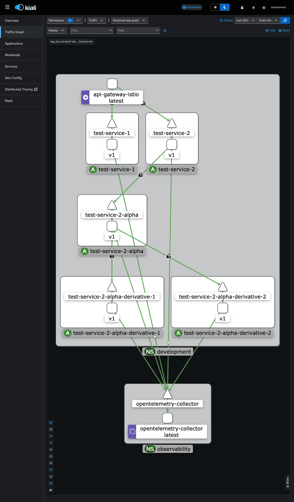

# `local-kubernetes-playground`



> [!IMPORTANT]
> The following guide was vetted on a Mac Studio, M1 Max 2022 on MacOS, Sonoma 14.5. Other systems are likely subject to
> incompatibilities.

## Requirements

- MacOS with Administrative Privileges
- [`cloud-provider-kind`](https://github.com/kubernetes-sigs/cloud-provider-kind)
- [Homebrew](https://brew.sh)
- [Kind](https://kind.sigs.k8s.io/docs/user/quick-start/)
- [`kubectl`](https://kubernetes.io/docs/tasks/tools/install-kubectl)
- [Docker Desktop](https://www.docker.com/products/docker-desktop/)
- [`istioctl`](https://istio.io/latest/docs/setup/getting-started/)
- [`ethr-cli`](https://github.com/x-ethr/ethr-cli)

## Usage

> [!NOTE]
> During the first minute or two, there may be a few warnings that surface. Due to Kubernetes reconciliation, all errors
> should resolve by minute three or four.

1. Setup a local load-balancer.
    ```bash
    go install sigs.k8s.io/cloud-provider-kind@latest
    sudo install "$(go env --json | jq -r ".GOPATH")/bin/cloud-provider-kind" /usr/local/bin
    sudo cloud-provider-kind
    ```
2. Create a cluster via `kind`.
    ```bash
    kind create cluster --config "configuration.yaml"
    kubectl config set-context "$(printf "%s-kind" "kind")"
    ```
3. Establish bootstrap secret(s).
    ```bash
    mkdir -p ./kustomize/secrets/.secrets
   
    printf "%s" "${GITHUB_USER}" > ./kustomize/secrets/.secrets/username
    printf "%s" "${GITHUB_TOKEN}" > ./kustomize/secrets/.secrets/password

    function access-key-id() {
        printf "%s" "$(aws secretsmanager get-secret-value --secret-id "local/external-secrets/provider/aws/credentials" --query SecretString | jq -r | jq -r ".\"aws-access-key-id\"")"
    }

    function secret-access-key() {
        printf "%s" "$(aws secretsmanager get-secret-value --secret-id "local/external-secrets/provider/aws/credentials" --query SecretString | jq -r | jq -r ".\"aws-secret-access-key\"")"
    }

    printf "%s" "$(access-key-id)" > ./kustomize/secrets/.secrets/aws-access-key-id
    printf "%s" "$(secret-access-key)" > ./kustomize/secrets/.secrets/aws-secret-access-key
    
    kubectl apply --kustomize ./kustomize/secrets --wait
    ```
4. Bootstrap.
    ```bash
    flux bootstrap github --repository "https://github.com/x-ethr/cluster-management" \
        --owner "x-ethr" \
        --private "false" \
        --personal "false" \
        --path "clusters/local"
    ```
5. Sync local cluster repository's `vendors`.
    ```bash
    git submodule update --remote --recursive
    ```
6. Add `kustomization.yaml` to new cluster directory.
    ```bash
    cat << EOF > ./vendors/cluster-management/clusters/local/kustomization.yaml
    apiVersion: kustomize.config.k8s.io/v1beta1
    kind: Kustomization
    resources: []
    EOF
    ```
7. Optionally, update the `Kustomization.flux-system.spec.interval`.
8. Push local changes to `vendors` submodules.
    ```bash
    git submodule foreach "git add . && git commit --message \"Git Submodule Update(s)\" && git push -u origin HEAD:main" 
    ```
9. Start the local registry.
    ```bash
    bash ./scripts/registry.bash
    ```
10. Wait for the various resources to reconcile successfully.
11. Initialize the kubernetes gateway.
    ```bash
    kubectl apply --kustomize ./applications 
    ```
12. Deploy all service(s).
    ```bash
    cd ./applications && make
    ```
    - *Note*: the Makefile targets in the ./applications directory will version bump all services, and requires a running container registry: `localhost:5050`. 

### Istio (Service-Mesh)

###### API Gateway

```bash
kubectl port-forward --namespace development service 
```

###### Kiali Dashboard

```bash
istioctl dashboard kiali
```

###### Tracing Dashboard (Jaeger)

```bash
istioctl dashboard jaeger
```

## Contributions

Please see the [**Contributing Guide**](./CONTRIBUTING.md) file for additional details.

## External Reference(s)

- [Official Schema Store](https://github.com/SchemaStore/schemastore/tree/master/src/schemas/json)
  - [OpenAPI 3.1](https://raw.githubusercontent.com/OAI/OpenAPI-Specification/main/schemas/v3.1/schema.json)
  - [OpenAPI 3.0](https://raw.githubusercontent.com/OAI/OpenAPI-Specification/main/schemas/v3.0/schema.json)
- [AWS EKS, Crossplane, Flux Sample](https://github.com/aws-samples/eks-gitops-crossplane-flux/tree/main)
    - [Blog Reference](https://aws.amazon.com/blogs/containers/gitops-model-for-provisioning-and-bootstrapping-amazon-eks-clusters-using-crossplane-and-argo-cd/)
- [Istio By Example](https://istiobyexample.dev/grpc/)
- https://istio.io/latest/about/faq/distributed-tracing/
- [Slog Guide](https://betterstack.com/community/guides/logging/logging-in-go/)
